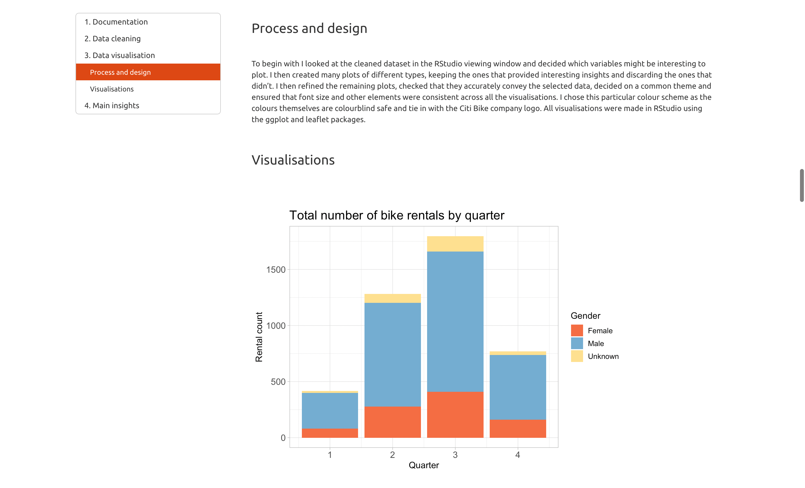

# Citi Bike NYC Analysis

## Overview

This repository contains an analysis of bike rental data from Citi Bike NYC. This project was undertaken as a part of CodeClan's Professional Data Analysis course.

[Click here to view the full document](citi_bike_nyc.html)

## Methodology

Through the use of data wrangling and key data visualisations, the aim of this report is to extract valuable insights from the data and present them in an appealing and informative way.

## Packages used

Data cleaning and wrangling was accomplished through the use of the `tidyverse` and `lubridate` packages. All visualisations were made using the `ggplot` and `leaflet` packages. The `nyc_bikes` dataset used is included in the `tsibbledata` package.

## Screenshots

## References

For more information on the dataset used and Citi Bike NYC, please see links below:

- https://rdrr.io/github/tidyverts/tsibbledata/man/nyc_bikes.html
- https://citibikenyc.com/
